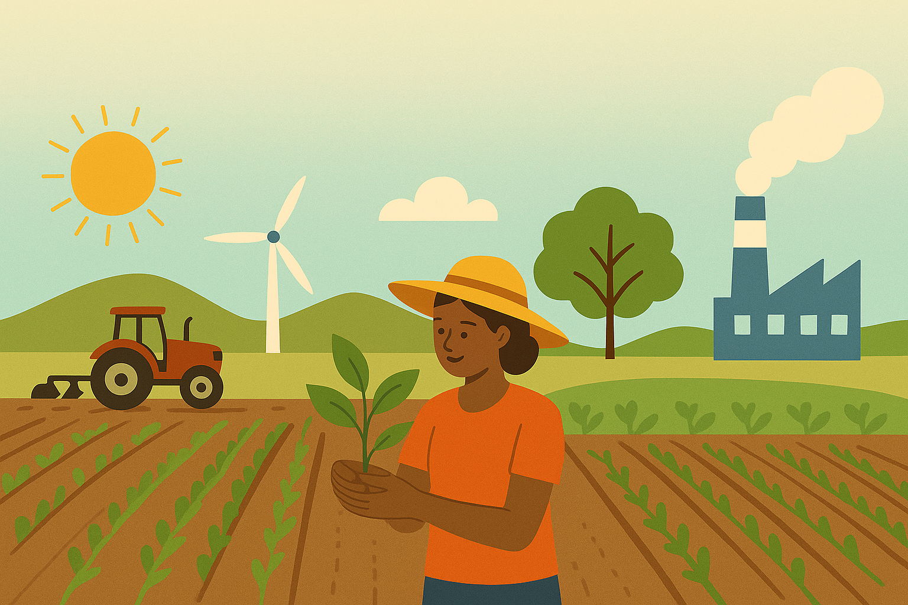

🌾 Climate Impact on Agriculture & Crop Prediction App

## Project Overview
Agriculture is highly sensitive to climate conditions such as rainfall, temperature, and soil quality.  
This project leverages **Machine Learning** and **Streamlit** to build an interactive web app that:

- Predicts the **most suitable crop** based on climate and soil parameters.
- Estimates the **expected yield (tons/hectare)** for given conditions.
- Visualizes data with **histograms and bar charts** for better understanding.

By combining climate data with ML, this app supports **farmers, researchers, and policymakers** in making **climate-aware agricultural decisions**.

---

## Features
- 📊 **Crop Prediction** using Logistic Regression.
- 🌱 **Yield Estimation** using Linear Regression.
-  **Visual Analytics**:
  - Histograms for continuous features (rainfall, temperature, yield).
  - Bar charts for discrete features (year, crop, state).
-  **User-Friendly Interface** built with Streamlit.
-  **Sustainability Focus**: Encourages data-driven farming practices.

---

##  Tech Stack
- **Python 3**
- **Streamlit** (UI framework)
- **Pandas** (data handling)
- **Scikit-learn** (ML models)
- **Matplotlib** (visualizations)
- **GitHub** (version control & hosting)

---
